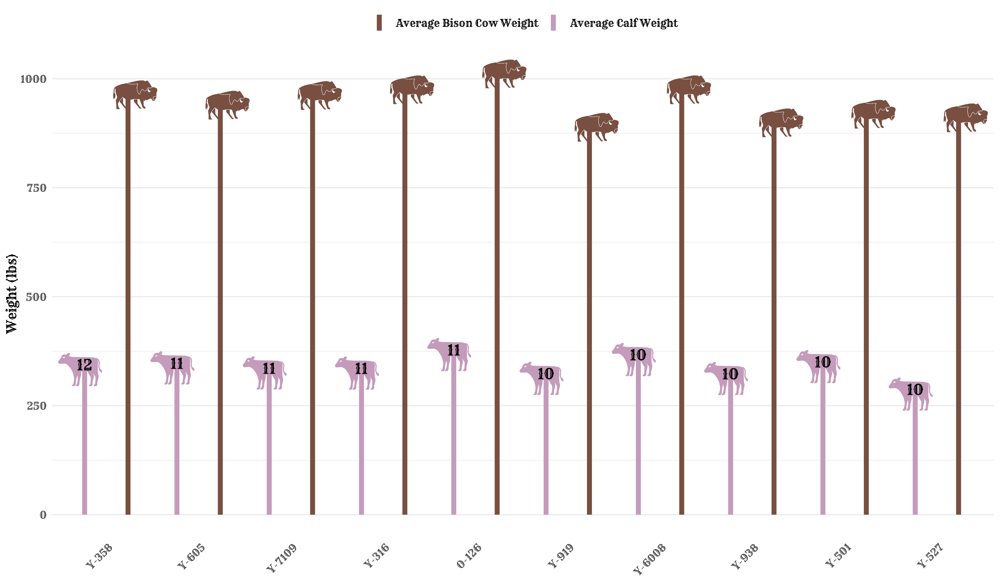

# Konza Prairie Bison Herd Database (Kansas, USA)


### Purpose:
This repository houses the code used to build a database about the Konza Prairie Bison Herd. The database integrates information about individual weight measurements, sex distributions, and maternal-calf parentage relationships. It also contains filed used to query the database and create a data visualization to answer the question: 

#### ***Which dams produced the most calves, and what was the average (end of season) weight of their offspring?***

### Data Visualization


### Repository Structure:
```
.
├── data
│   ├── cleaned-data            # Cleaned data
│   └── konza-prairie-bison     # Raw data
├── data_viz.qmd                # Script to create visualization
├── data.db                     # Database
├── dataset_cleaning.qmd        # Script to clean raw data
├── eds213-database-final.Rproj
├── images
├── query.sql                   # Script to query the database
└── README.md
```

### Data Access:
- Source: [Environmental Data Initiative](https://portal.edirepository.org/nis/mapbrowse?packageid=knb-lter-knz.78.17)
- Data Accessed: April 10th, 2026

### References: 
Blair, J. 2026. CBH01 Konza Prairie bison herd information ver 17. Environmental Data Initiative. https://doi.org/10.6073/pasta/c5c3f6e3df8a42980599a2ebba1abc84 (Accessed 2026-04-29).

### Author

Jaslyn Miura

### Acknowledgments
The material for this assignment was presented by TA Annie Adams in the course Databases and Data Management (EDS 213) at the Bren School of Environmental Science & Management, Spring 2026. The instructors of this course were Julien Brun, Greg Janée, Renata Curty.
